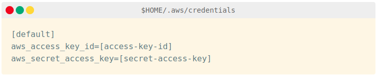
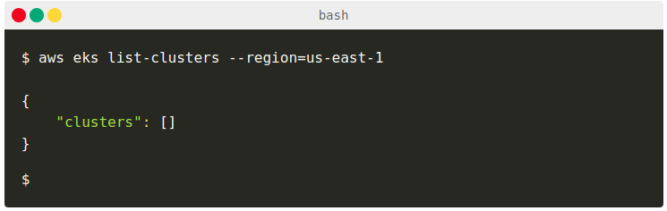
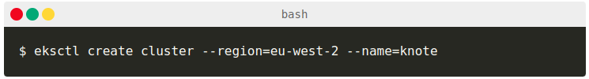

# EKS

You should save the access key ID and secret access key in a file named ~/.aws/credentials as follows:

Remember to include the [default] in the file!

Now, you can install the [aws-cli]('https://github.com/aws/aws-cli')

> sudo python -m pip install awscli

If you are authenticated, when you run the command below, you should get a valid response as such if you have not created any clusters before.

## Creating a Kubernetes cluster on AWS

With eksctl installed, it's time to create an Amazon EKS cluster.

Run the following eksctl command:

The command creates an Amazon EKS Kubernetes cluster with the following properties:

- Two worker nodes (this is the default)
- The worker nodes are m5.large Amazon EC2 instances (this is the default)
- The cluster is created in the eu-west-2 region (London)
- The name of the cluster is knote

> While you wait for the cluster being created, you have some time to think about Amazon EKS.

Amazon EKS is a managed Kubernetes service, in the sense that AWS runs the Kubernetes control plane for you.

That means, AWS runs the master nodes, and you run the worker nodes.

AWS runs three master nodes in three availability zones in your selected region.

### The application is made of two parts:

A front-end written in Node.js and Express.
A MongoDB to persist the data.

While it might not seem a lot, if you forget to delete your cluster, it could add up quickly.

That's why you should always delete your Amazon EKS cluster when you don't need it anymore.

You can do this conveniently with eksctl:

> eksctl delete cluster --region=eu-west-2 --name=knote